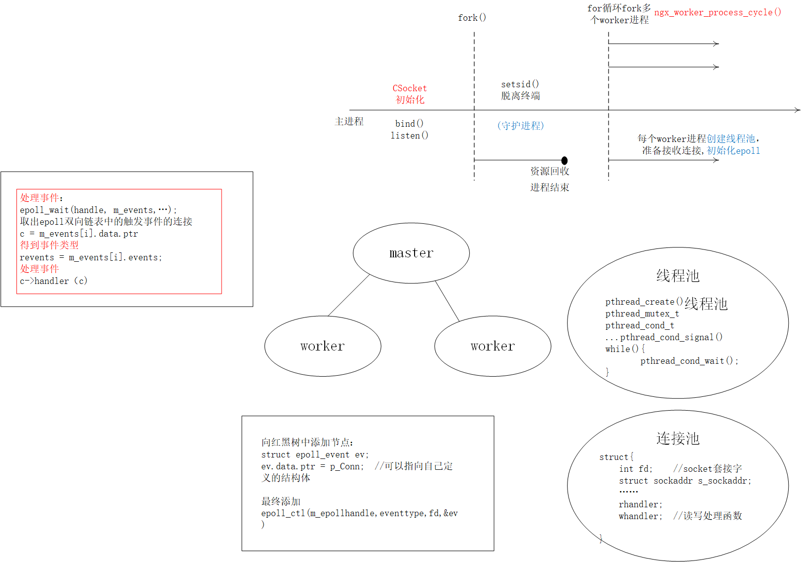
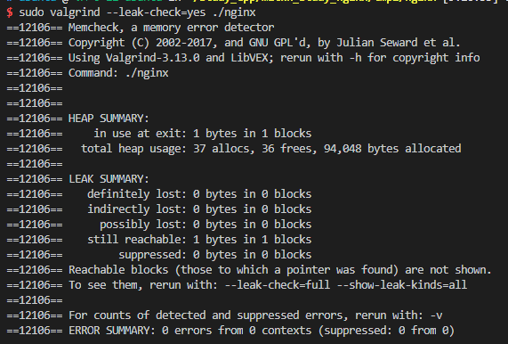

<!--
 * @Author: your name
 * @Date: 2020-12-06 10:07:28
 * @LastEditTime: 2021-03-11 09:19:35
 * @LastEditors: Please set LastEditors
 * @Description: In User Settings Edit
 * @FilePath: /mztkn_study_nginx/nginx/README.md
-->
# nginx源码通信架构/部分c++特性

根据nginx源码一点一点补充

## 程序示意图

## 一些测试

## 规划目录

(a) _include目录：专门存放各种头文件

(b) app 目录： 放主应用程序

    (b.1) link_obj: 临时目录，会存放临时的.o文件，这个目录不手工创建，后续用makefile脚本创建

    (b.2) dep: 临时目录，会存放临时的.d开头的依赖文件，依赖文件能够告知系统哪些相关文件发生变化

    (b.3) nginx.c ： 主文件，main入口函数

    (b.4) ngx_conf.c: 普通源码文件，跟主文件关系密切

    (b.5) ngx_setproctitle.c: 设置进程标题

    (b.6) ngx_string: 字符串处理相关函数,头文件在"ngx_func.h"中

    (b.7) ngx_printf.c: 和打印格式相关的函数,头文件在"ngx_func.h"中

    (b.8) ngx_log.c: 和日志相关的函数

(c) misc目录：专门存放各种杂合性的不好归类的1到多个.c文件

(d) net目录：专门存放网络处理相关的代码
    
    (d.1) ngx_c_socket.cpp 打开socket，绑定，监听配置文件中设置的端口

(e) proc目录：专门存放和进程处理有关的
    
    (e.1) ngx_daemon.cxx 创建守护进程

    (e.2) ngx_process_cycle.cxx 创建子进程

    (e.3) ngx_event.cxx 处理网络和定时器事件

(f) signal目录：专门存放和信号处理有关的目录

(g) doc目录，增加写这些程序用到的一些技术，心得体会等等